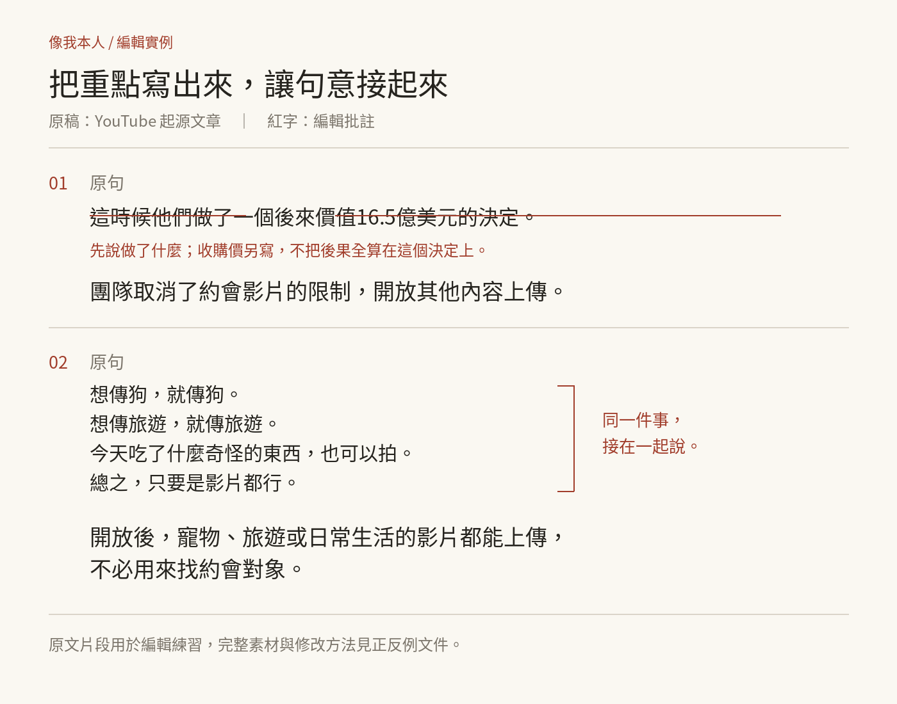

# 像我本人 LikeMe｜繁體中文寫作、文案改稿與去 AI 味 Skill


**像我本人（LikeMe）** 是給 Claude Code、Codex 與 Cursor 使用的台灣繁體中文寫作 Skill，提供自然寫作、文章改寫與文案編輯，保留作者語氣、事實與必要條件。

Traditional Chinese writing and editing skill for Claude Code, Codex and Cursor. Preserve the author's voice and facts while removing repetitive phrasing and generic disclaimers.

我最受不了 AI 寫文章的一種習慣，是話已經說完了，還要再補一句。

「這個流程能省時間，但不代表每個人都能得到相同效果，仍需視實際情況而定。」

如果只是有根據的推論，寫「這個流程應該能省時間」就夠了，真有條件會改變做法，就把條件講清楚，「最多 18 人，完成付款後保留名額」比「實際安排仍需視情況而定」有用。

我把這些編輯習慣做成 **像我本人（LikeMe）**，技能呼叫名稱沿用 `hans-human-writing`，可以拿來改稿，也可以根據素材新寫文章。

[直接看技能](hans-human-writing/SKILL.md) · [圖文安裝與使用教學](docs/guide.md) · [測試題與結果](evals/README.md) · [設計與參考來源](docs/design-notes.md)

## 為什麼只列禁詞，改出來還是很 AI？

因為文章的問題常常出在內容。

同一個道理換了四種說法，每段都像新發現；一個產品轉向的故事，跳過中間的成長過程，直接接到十幾億美元的收購；作者沒有提供經歷，AI 卻加上「我當下愣住了」，這些問題換幾個詞也救不了。

我拿一篇 YouTube 起源文章當編輯案例，它的具體細節很好：徵求約會影片、開放其他用途、動物園裡的大象，但後面反覆談承認猜錯、觀察使用者、信念與謙遜，說的其實很接近，讀者一直往下滑，得到的新理解卻很少。

所以這個技能會先整理主張與資料，再決定哪些句子要留，沒有作用就直接刪，必要資訊才改寫，人物、數字、條件、推理與有作用的故事細節都要保住。

## 它怎麼改？

1. 找出讀者、用途與作者要說的一件事。
2. 記下不能漂移的資訊：價格、日期、URL、引語、否定、承諾與限制。
3. 刪掉無效句子，合併重複論點，把有用的資訊寫清楚。
4. 把確定程度放回原句，必要條件寫成規則或下一步。
5. 回查資訊與作者立場，完成後直接交稿。

自然的原文就保留，正常的對比、情緒、長句與短句都有用途，不會看到某個句型就一律刪除。

## 改寫前、改寫後

YouTube 案例節錄自我提供的原稿，其餘是教學情境，每組交代素材，改稿只用這些資料。



### YouTube：先說做了什麼

**改寫前**

> 這時候他們做了一個後來價值16.5億美元的決定。

**改寫後**

> 團隊取消了約會影片的限制，開放其他內容上傳。

這次先修兩件事：把動作寫出來，拆開產品轉向與後來的收購，想解釋 16.5 億美元的收購，還需要中間的採用與成長資料。

### YouTube：例子留著，句意接起來

**改寫前**

> 想傳狗，就傳狗。
>
> 想傳旅遊，就傳旅遊。
>
> 今天吃了什麼奇怪的東西，也可以拍。
>
> 總之，只要是影片都行。

**改寫後**

> 開放後，寵物、旅遊或日常生活的影片都能上傳，不必用來找約會對象。

這些例子在說明允許的用途，合併後仍保有畫面，不會變成聲稱當時已有這些影片。

### 1. 把預防性補句放回原句

**素材：** 新流程取消人工分類，還沒有計時紀錄。

**改寫前**

> 這個流程能大幅提升效率，但不代表每個人都能得到相同效果，仍需視實際情況而定。

**改寫後**

> 這個流程省掉了人工分類，應該能減少整理時間。

已知的機制直接寫，推論只校準一次，「應該」也不能拿來替沒來源的數字上妝。

### 2. 課程公告先讓人知道怎麼參加

**素材：** 12 月 13 日 09:30–12:00，台北時間；最多 18 人；NT$2,400；自備電腦；付款後保留名額；額滿可候補。

**改寫前**

> 在瞬息萬變的 AI 時代，我們誠摯邀請您參與一場不只是學習、更是轉變的旅程。但不代表報名就一定能參加，仍需依付款與名額而定。

**改寫後**

> 12 月 13 日 09:30–12:00（台北時間）上課，費用 NT$2,400，請自備電腦，現場最多 18 人，完成付款後保留名額，額滿可登記候補。

這組是從原稿加上素材重寫，日期、價格與規則都來自上面的素材，沒有新增課程成效或熱銷故事。

### 3. 客服回覆給出確定的下一步

**素材：** 包裹缺轉接頭；團隊已確認缺件；正在查庫存；明天下午 3 點前回覆庫存結果；寄出時間尚未確定。

**改寫前**

> 很抱歉為您帶來不便，我們將積極處理這個問題，努力帶給您最好的服務，但不代表所有狀況都能立即獲得解決。

**改寫後**

> 包裹漏了轉接頭，抱歉，我們正在確認補件庫存，明天下午 3 點前會回覆庫存結果，確認後再安排寄出時間。

保留道歉，也把正在做的事與回覆期限寫清楚，不把「回覆庫存」偷偷改成「明天寄出」。

### 4. 已經自然的文字，直接留

**素材與原文：**

> 雨停了，我還坐在騎樓下，不想回去。

**處理：保留原文。**

相連的畫面與情緒用逗號接起來，結尾才加句號，這是我的標點習慣，已符合就保留，不補「那一刻，我突然懂了人生」。

[正反例與修正方法](hans-human-writing/references/editing-examples.md) 裡有 8 組 YouTube 原文案例，逐組說明改什麼、為什麼改。

## 哪些工作可以用？

| 工作 | 交給技能的資料 | 你會得到什麼 |
| --- | --- | --- |
| 社群觀點 | 事件、立場、理由、例子 | 有判斷的完整貼文 |
| 課程或活動公告 | 對象、時間、價格、限制、報名方式 | 能看懂、能報名的公告 |
| 案例長文 | 來源、事件順序、想回答的問題 | 保留過程與推理的文章 |
| 教學 | 目標、步驟、前提、卡住的位置 | 可以照著完成的說明 |
| 商務通知與客服 | 目前狀態、責任、期限、承諾 | 直接而有禮貌的回覆 |
| 產品文案 | 實際功能、適用對象、證據、CTA | 具體且有根據的介紹 |

## 安裝

在終端機執行，接著選擇你使用的工具與安裝範圍：

```bash
npx skills add hansai-art/likeme --skill hans-human-writing
```

這是 Vercel Skills CLI 支援的 GitHub 專案來源格式，需要 Node.js 與網路，也可以不用安裝器，直接把 `hans-human-writing` 資料夾放到工具的技能目錄，步驟見 [圖文教學](docs/guide.md)。

## 第一次用，這樣交代

```text
請使用 hans-human-writing。
用途：Facebook 觀點長文，約 800 字。
讀者：想把 AI 用在日常工作的主管。
我的主張：先試一個重複工作，再決定是否擴大。
素材：〔貼上已確認資料〕
原文：〔貼上文章；新寫可省略〕
請保留事實、我的判斷與必要條件，直接交完整成稿。
```

想看改了哪裡，加一句「請附改寫前後對比與三項修改理由」，只想修語氣，就寫「不要刪資訊，不要重排全文」。

## 怎麼知道它有沒有用？

目前累積 14 個任務：7 個改稿、6 個應保留的片段、1 個新寫文章，題目包含價格與 URL 保護、客服承諾、物理術語、自然敘事與標點、長文資訊保留，以及混在素材裡的無關指令。

[測試紀錄](evals/results.md) 公開題目、實際輸出與人工判讀，重點是文章是否清楚、資料是否完整、作者立場有沒有被磨平，看到同類問題，就用具體失敗案例修規則，再試一次。

## 參考與授權

這個技能從我們的文章案例與改稿回饋出發，也參考 [speak-human-tw](https://github.com/Raymondhou0917/speak-human-tw)、維基百科與其他中文、英文編輯技能，來源與採用方式列在 [設計筆記](docs/design-notes.md)。

像我本人使用 [MIT License](LICENSE)，歡迎拿去用、調整成自己的寫作習慣，或提出具體改稿案例，來源與設計差異整理在 [設計筆記](docs/design-notes.md)。

作者：林思翰（Hans） · 技能版本：2.2.0 · 2026-10-02
