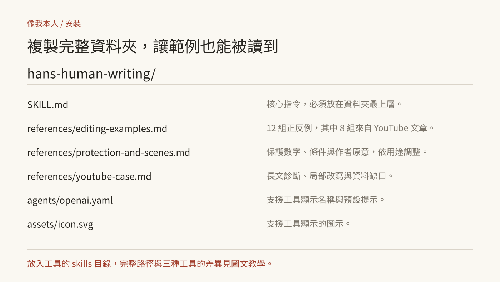

# 像我本人：安裝與使用圖文教學

先選安裝方式，再交一份有素材的寫作需求，以下把安裝路徑、交稿格式與實際改稿連起來，圖中的文字與步驟都有對應說明。

## 1. 確認要放哪裡



技能的核心是 `SKILL.md`，範例與場景規則放在 `references/`，安裝時複製完整的 `hans-human-writing` 資料夾，讓相對連結能找到檔案，README、教學圖與測試資料不用一起裝進技能目錄。

| 本機工具 | 只供目前專案使用 | 在這台電腦跨專案使用 |
| --- | --- | --- |
| Claude Code | `.claude/skills/hans-human-writing/` | `~/.claude/skills/hans-human-writing/` |
| Codex | `.agents/skills/hans-human-writing/` | `~/.agents/skills/hans-human-writing/` |
| Cursor | `.cursor/skills/hans-human-writing/` | `~/.cursor/skills/hans-human-writing/` |

`~` 表示使用者的家目錄，Windows 手動複製時，在自己的使用者資料夾下建立對應目錄，這裡說的是本機技能；雲端工作階段要用該產品支援的帳號同步或專案技能方式。

表格依 2026-10-02 官方文件核對：[Claude Code](https://code.claude.com/docs/en/skills)、[Codex](https://learn.chatgpt.com/docs/build-skills)、[Cursor](https://cursor.com/docs/skills)。

## 2. 方式 A：用安裝器

先確認電腦有 Node.js，打開終端機，貼上：

```bash
npx skills add hansai-art/likeme --skill hans-human-writing
```

安裝器會依目前版本提供工具與範圍選擇，選你要使用的工具；只在此專案用就選專案範圍，跨專案使用就選全域範圍，執行前可以先閱讀 [技能內容](../hans-human-writing/SKILL.md)。

這個命令的來源格式依 [Vercel Skills CLI 官方說明](https://github.com/vercel-labs/skills#source-formats) 編寫，此專案的驗證包含公開檔案與命令格式核對，未逐一在三款工具中執行安裝。

## 3. 方式 B：手動複製

1. 在 GitHub 打開這個專案，下載或取得檔案。
2. 找到專案根目錄的 `hans-human-writing/`，複製整個資料夾。
3. 放進上表的目錄，確認最終檔案位於例如 `~/.agents/skills/hans-human-writing/SKILL.md`。
4. 同一個資料夾下應有 `references/` 與 `agents/`，不是再多包一層同名資料夾。
5. 在工具裡開新工作階段，請它讀取 `hans-human-writing`，若沒有找到，先檢查路徑與 `SKILL.md` 檔名。

只想試寫，也可以把 `SKILL.md` 與它要求的參考文件交給對話模型，要求依這些規則改稿，這是單次套用，之後的新對話要再次提供規則。

## 4. 第一次交稿：把素材列清楚

不用填問卷，通常交代用途、讀者、素材、立場與範圍就夠了。

```text
請使用 hans-human-writing 改稿。
用途：課程公告。
讀者：已經用過 ChatGPT，想練習工作應用的人。
素材：12 月 13 日 09:30–12:00（台北時間）、最多 18 人、
NT$2,400、自備電腦、付款後保留名額、額滿可候補。
原文：〔貼上原稿〕
報名連結：〔貼上實際連結〕
直接交可發布版本，價格、時間、規則與連結全部保留。
```

素材不必寫漂亮，它的用途是讓改稿有依據，避免為了寫得精彩，補出你沒說過的成果與經歷。

## 5. 四種常用交付方式

### 直接改稿

```text
請使用 hans-human-writing 改寫下面這篇文章。
保留我的判斷與關鍵細節，直接給完整成稿。
〔原文〕
```

適合你已經知道方向，只需要一版可用文章。

### 微調語氣，保留內容

```text
請使用 hans-human-writing，只修語氣。
不要刪資訊、不要重排全文，保留所有段落的功能與故事細節。
〔原文〕
```

適合你已完成文章結構，只想清掉模板句與補句。

### 先看問題與對比

```text
請使用 hans-human-writing，挑出最影響閱讀的五項問題。
每項附一段改寫前後對比；先不要重寫全文。
〔原文〕
```

適合要學改稿，或與同事討論修改方向。

### 從素材新寫

```text
請使用 hans-human-writing 新寫一篇約 800 字文章。
用途：社群觀點。
讀者：〔對象〕
我的主張：〔你怎麼判斷〕
已確認資料：〔事實與來源〕
假設情境：〔如果需要〕
請直接交完整成稿。
```

新寫文章時，把真實案例與假設分開交代，沒有成效資料，就寫已知機制或提出測量方式。

## 6. 用產品起源案例練一次

這張圖用原稿兩段示範，紅字是編輯決定，改稿見圖下方與 [完整 8 組案例](../hans-human-writing/references/editing-examples.md)。

1. 原句先宣布「價值 16.5 億美元的決定」，讀者還不知道團隊做了什麼，先改成取消約會限制、開放其他影片。
2. 「想傳狗，就傳狗」「吃了什麼奇怪的東西」有具體畫面，原文自然就保留原字句與段落節奏，只整理標點或分段。
3. 收購價另有來源與事件時間，要解釋轉向如何帶來成長，就補中間資料。

貼這段需求，請技能挑最影響閱讀的地方：

```text
請使用 hans-human-writing，分析下面這篇產品起源文章。
挑五項最影響閱讀的問題，每項附原句、改句與修改方法。
這次先做局部編輯，不補造歷史資訊，也先不重寫全文。
〔貼上原稿〕
```

逐項看過後，再請它整合：

```text
依剛才的修改方向整合全文。
保留人物、事件、金額與有作用的場景，刪除沒有新增資訊的旁白；自然口語與具體例子不要改成分類式摘要。
相連句意用逗號接，說完才加句號，直接交完整成稿。
```

## 7. 看改稿時，檢查四件事

| 檢查 | 你可以怎麼看 |
| --- | --- |
| 事實 | 對照數字、價格、日期、URL、引語；「最多」「尚未」「不含」有沒有變？ |
| 原意 | 作者選擇與理由還在嗎？必要步驟、條件與故事細節有沒有漏？ |
| 語氣 | 是否直接說事情？是不是又把同一個道理寫了三次？ |
| 完成度 | 標題承諾有回答嗎？結尾說完後，有沒有再加另一輪感想？ |

不合用就指出具體位置：「第二段把我的批評磨平了」「價格與候補規則漏了」「結尾又說一次相同道理」，這種回饋比只說「更有人味」容易修好。

## 8. 常見卡點

**它把文章改太短**：明確要求保留內容與篇幅，或使用「只修語氣」模式；技能會回查每段作用。

**它加了我沒說過的故事**：指出那段不是你的經歷，要求只依素材改稿；把作者提供的經歷與示例分開。

**它一直補「但不代表」**：請它檢查補句是否提供新資訊，沒有就刪；有報名、付款或安全條件，就改成直接規則。

**正常術語被改掉**：把它標成專業術語；「物體質量」「水平方向」不該套用商務用詞替換。

**換了很多詞，問題還在**：指出實際問題是重複論點、欠缺過程，或沒有具體例子，要求先修內容。

## 9. 留下自己的風格樣本

提供兩三段你已經寫好、也喜歡的文字，交代哪些是風格樣本、哪些是待改原稿，再補一句最在意的習慣，例如「相連句意用逗號，結尾才加句號」或「先講我的判斷，再解釋理由」，不要把你不喜歡的 AI 原稿標成本人範本。

保留自己常用的需求格式，每次換素材與立場，收到自然、清楚的稿子就用；需要調整就拿具體段落回饋，讓下一版規則更準。
